# 🎓 Mentora (Coursera Clone)


> 🎓 A modern Flutter e-learning app with Firebase authentication, course browsing, and progress tracking.

A demo Flutter e-learning app inspired by **Coursera**.  
Users can browse courses, enroll, watch lessons, and track their progress.  
Built with **Flutter** and **Firebase**.

---

## ⚡ Features
- 🔑 Firebase Authentication (Sign up / Log in)
- 📚 Browse and search available courses
- 🎥 Watch lessons (sample video integration)
- ✅ Track course progress
- 👨‍🏫 User roles: Students & Instructors
- ⚙️ User settings and profile management

---

## 📸 Screenshots

| Home Screen | Courses | Course Details |
|-------------|---------|----------------|
|  |  | 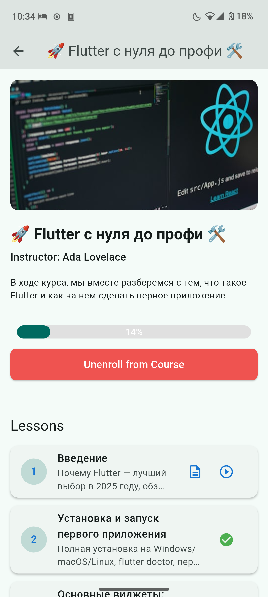 |

| Enroll | My Courses | Search | Profile |
|--------|------------|--------|---------|
| 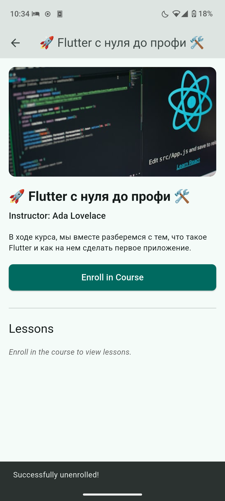 | 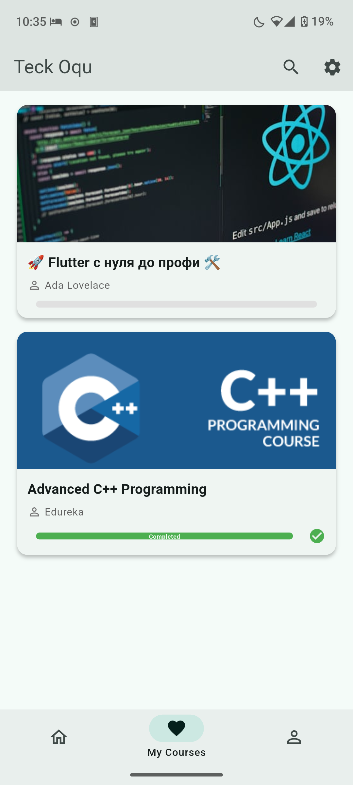 | 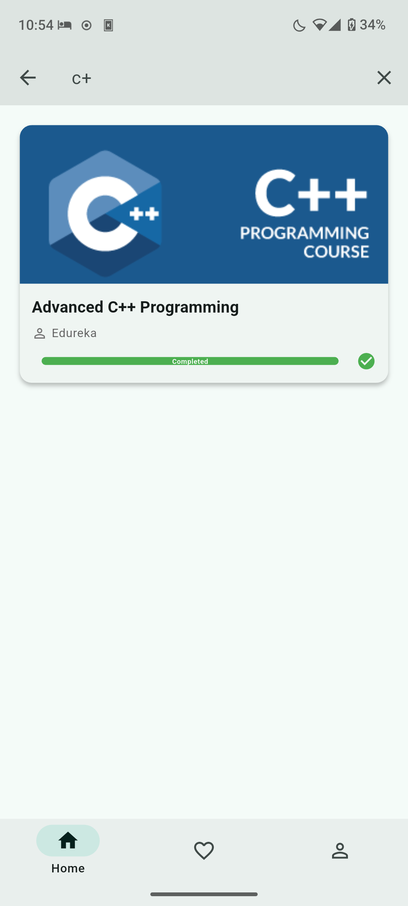 | 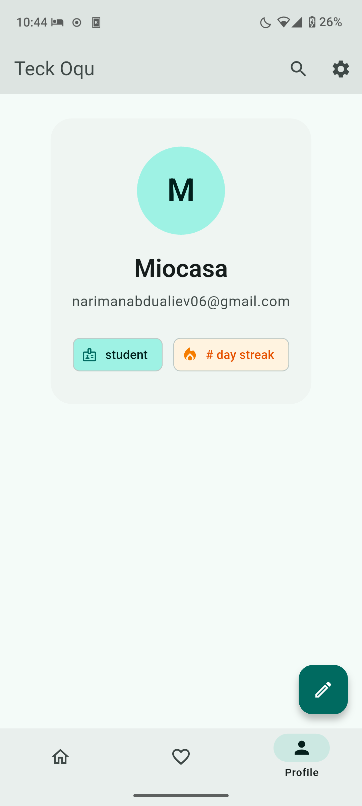 |

| Text lesson (markdown) | Text lesson navigation | Video lesson | 
|------------------------|--------------|--------------|
| 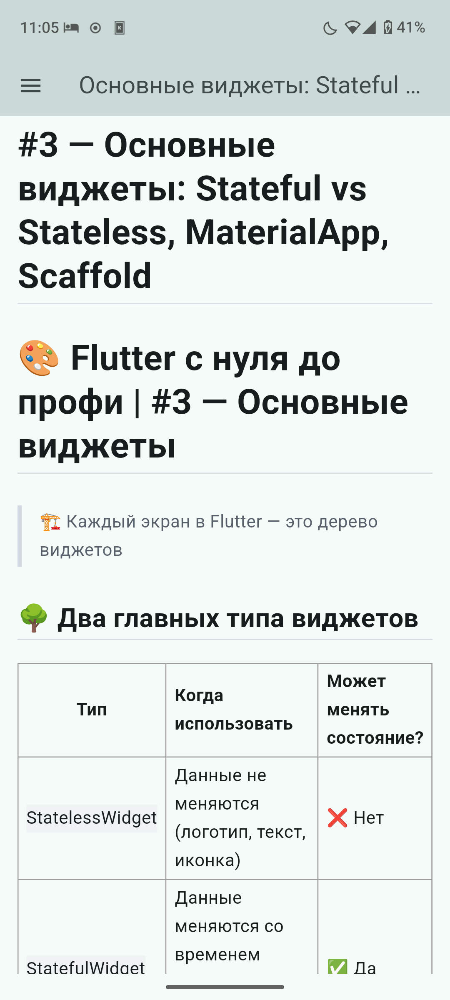 | 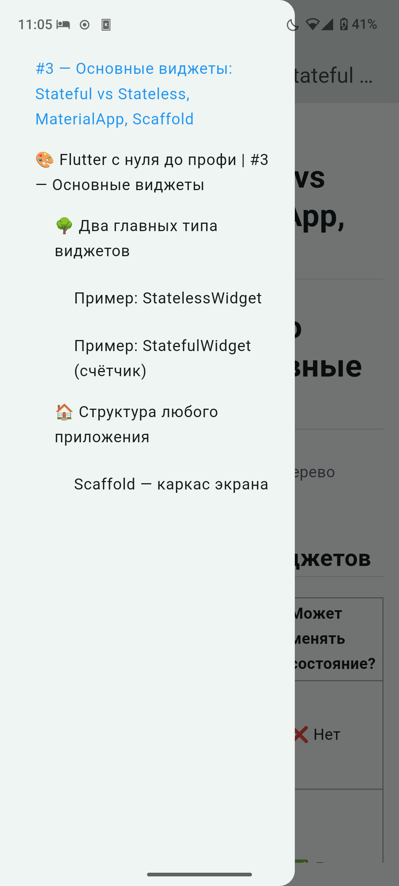 | 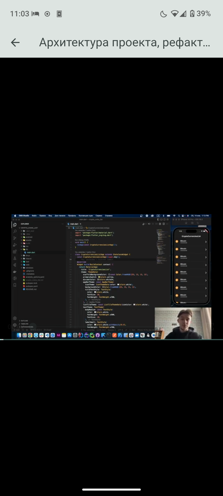 |

| Login | Signup | Users | Settings |
|-------|--------|-------|----------|
| 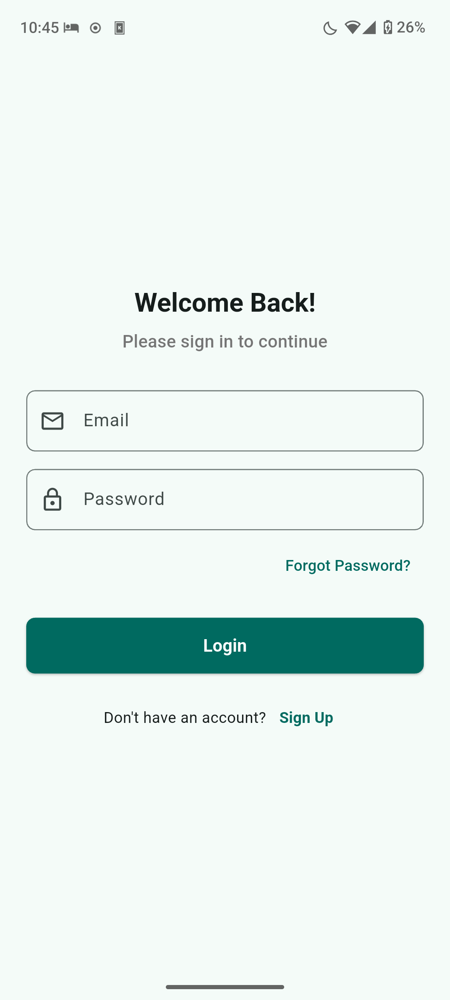 | 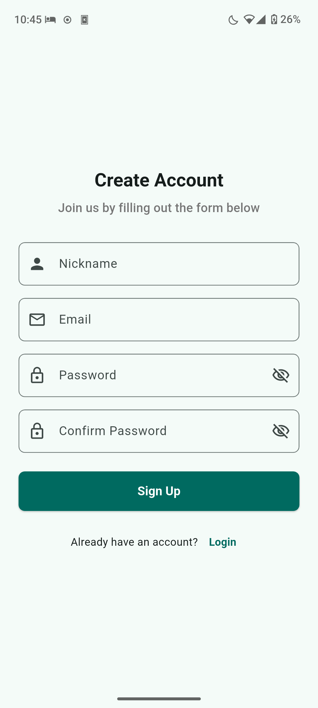 |  | 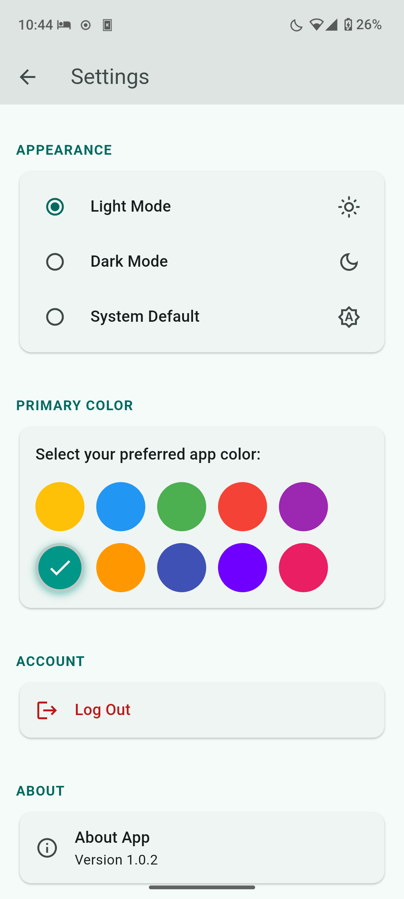 |

---

## 🚀 Getting Started
Clone the repo and run locally:
```bash
git clone https://github.com/Miocasa/.git
cd e-learn
flutter pub get
flutter run
```

## 📜 License
This project is licensed under the MIT License - see the [LICENSE](LICENSE) file for details.


## ✨ Author
👩‍💻 Done by Miocasa  
🌐 Localization made by [https://github.com/xredworm]("xredworm")   
🌳 Fork from [e-learn]("https://github.com/mrxyz606/e-learn"), made by [mrxyz606]("https://github.com/mrxyz606")   
📧 Contact: [narimanabdualiev06@gmail.com](mailto:narimanabdualiev06@gmail.com)  
🔗 GitHub: [Miocasa](https://github.com/Miocasa)  
